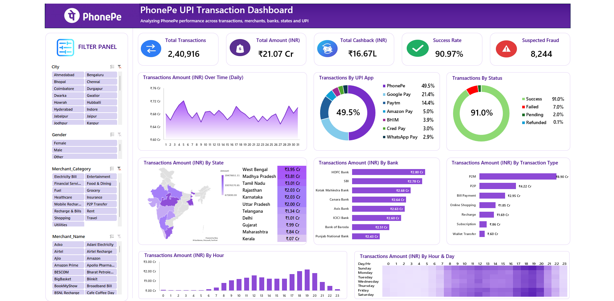

<div align="center">

<!-- Animated header banner (capsule-render) -->


<!-- Animated typing subtitle -->
<a href="#">
  
</a>

<br/>

<!-- Badges -->


</div>

---

## 📌 Overview

The **PhonePe UPI Transaction Dashboard** is an interactive, single-view analytics dashboard built entirely in **Microsoft Excel**, designed to analyze real-time-style UPI transaction data across **cities, banks, merchants, UPI apps, and time**.

The underlying dataset contains **502,887 raw transaction records** (May 2026) across **7 UPI apps**, **11 states**, **42 cities**, **8 partner banks**, and **17 merchant categories**. After cleaning, this rolls up into **2,40,916 valid transactions worth ₹21.07 Cr**, visualized through slicers, KPI cards, donut breakdowns, a choropleth-style India map, and an hour × day heatmap — so patterns in spending, success rate, and suspected fraud are visible at a glance.

> Built as part of an **AI & Data / Make Data Intelligent** masterclass project.

---

## 🖼️ Preview

<div align="center">
  
</div>


---

## 🎬 Demo Video

<div align="center">

[](https://youtu.be/YOUR-VIDEO-ID)

*Click the thumbnail above to watch the full walkthrough on YouTube.*

</div>

> 💡 **How to add your real demo video** (pick one):
> - **YouTube (recommended, easiest):** Upload your screen-recording to YouTube (even as "Unlisted"), then replace `YOUR-VIDEO-ID` above with your video's ID, and `./assets/video-thumbnail.png` with a screenshot/thumbnail image saved in your `assets/` folder.
> - **Native GitHub video:** Open a new GitHub Issue in your repo, drag-and-drop your `.mp4` file into the comment box (don't submit the issue), wait for it to upload, then copy the generated `https://github.com/user-attachments/assets/...` link it creates. Paste that link directly below instead of the YouTube embed:
>   ```html
>   <video src="https://github.com/user-attachments/assets/YOUR-LINK" controls width="100%"></video>
>   ```
>   This plays natively inside the README on GitHub, no click-through needed — but the link only works because it's hosted on GitHub's own CDN, not an arbitrary external URL.

---

## ✨ Key Features

- 🔄 **Live-style KPI Cards** — Total Transactions, Total Amount, Total Cashback, Success Rate, and Suspected Fraud, all in one glance.
- 🎛️ **Dynamic Filter Panel** — Slice data instantly by **City, Gender, Merchant Category,** and **Merchant Name**.
- 🍩 **App & Status Breakdown** — Donut charts for transaction share by **UPI App** (PhonePe, Google Pay, Paytm, etc.) and by **Status** (Success/Failed/Pending/Refunded), each with a headline % in the center.
- 🗺️ **State-wise Heat Map** — Choropleth map of India showing transaction volume by state, paired with a ranked table.
- 🏦 **Bank & Transaction-Type Analysis** — Horizontal bar breakdowns of amount by bank and by transaction type (P2M, P2P, Bill Payment, etc.).
- ⏰ **Time-based Patterns** — Daily trend line, hourly transaction volume, and an **Hour × Day heatmap** to spot peak activity windows.
- 🚨 **Fraud Monitoring** — Dedicated suspected-fraud KPI to flag anomalies at a glance.

---

## 📊 Dashboard at a Glance

| Metric | Value |
|---|---|
| Total Transactions | **2,40,916** |
| Total Amount (INR) | **₹21.07 Cr** |
| Total Cashback (INR) | **₹16.67L** |
| Success Rate | **90.97%** |
| Suspected Fraud Cases | **8,244** |
| Top UPI App | **PhonePe — 49.5% share** |

---

## 🛠️ Tech Stack

<div align="center">


</div>

- **Microsoft Excel** — data modeling, pivot tables & pivot charts
- **Slicers** — interactive filtering (City, Gender, Merchant Category, Merchant Name)
- **Excel Map Chart** — state-wise transaction visualization
- **Conditional Formatting / Heatmap** — hour × day intensity matrix
- **Formulas** — aggregation, KPI calculations, formatted currency labels (₹, Cr, L)

---

## 🗃️ Dataset Schema

The `raw_upi_data` sheet holds **24 fields** per transaction, including:

`Transaction_ID` · `Transaction_Date` · `Transaction_Time` · `UPI_App` · `Customer_ID` · `Age_Group` · `Gender` · `State` · `City` · `Merchant_Name` · `Merchant_Category` · `Transaction_Type` · `Payment_Mode` · `Bank_Name` · `Amount_INR` · `Cashback_INR` · `Transaction_Fee_INR` · `Status` · `Failure_Reason` · `Device_OS` · `Risk_Score` · `Is_Suspected_Fraud` · `Hour` · `Day`

This granularity is what powers the dashboard's fraud-risk scoring, hour × day heatmap, and device/OS-level breakdowns.

---

## 📁 Folder Structure

```
📦 phonepe-upi-dashboard
 ┣ 📂 assets
 ┃ ┣ 🖼️ dashboard-full.png
 ┃ ┣ 🖼️ kpi-cards.png
 ┃ ┣ 🖼️ state-map.png
 ┃ ┗ 🖼️ video-thumbnail.png
 ┣ 📊 Phone_Pay_Excel_Project.xlsx
 ┃ ┣ 📄 raw_upi_data     (502,887 raw transaction records)
 ┃ ┣ 📄 Sheet1           (pivot summaries & aggregations)
 ┃ ┣ 📄 Image matrices   (UPI app share matrix for chart visuals)
 ┃ ┗ 📄 UPI Dashboard    (final interactive dashboard)
 ┗ 📄 README.md
```

---

## 🚀 How to Use

1. **Clone this repository**
   ```bash
   git clone https://github.com/Gatil1616/PhonePe-UPI-Transaction-Analysis

   ```
2. **Open the Excel file**
   Open `Phone_Pay_Excel_Project.xlsx` in Microsoft Excel (2016 or later recommended for map charts). Go to the **UPI Dashboard** sheet tab.
3. **Explore with filters**
   Use the **Filter Panel** on the left (City, Gender, Merchant Category, Merchant Name) to slice the dashboard interactively.
4. **Enable content / macros** (if prompted) to ensure all charts and slicers render correctly.

---

## 🧠 Insights Uncovered

- **PhonePe leads UPI app usage** with a 49.5% share, followed by Google Pay (21.4%) and Paytm (14.4%).
- **P2M (merchant) transactions** dominate transaction-type volume at ₹8.90 Cr.
- **HDFC Bank and SBI** account for the highest transaction amounts among partner banks.
- Transaction activity **peaks in the evening hours**, visible clearly in the Hour × Day heatmap.
- Suspected fraud sits at **8,244 cases**, a metric worth cross-referencing against high-risk states/banks for deeper investigation.

---

## 🗺️ Roadmap

- [ ] Add a dynamic date-range slicer
- [ ] Add legends/scales to the map and heatmap visuals
- [ ] Reconcile Success Rate KPI with the Status donut for consistent reporting
- [ ] Publish a Power BI version for web-based interactivity

---

## 🤝 Contributing

Suggestions and improvements are welcome! Feel free to open an issue or submit a pull request.

---

## 👤 Author

<div align="center">


This project was created as part of my data analytics portfolio to demonstrate skills in **Excel, data cleaning, data analysis, pivot tables, visualization, and dashboard development.**

## 👤 Connect with Me

<a href="https://www.linkedin.com/in/gatil-dhawan-474097340/">
  
</a>
<a href="https://github.com/Gatil1616">
  
</a>
<a href="mailto:sandeepsks008@gmail.com">
  
</a>

</div>

---

## ⭐ Show Some Love

If you found this project useful or interesting, consider giving it a **star** ⭐ — it helps a lot!

<div align="center">


</div>

<div align="center">

</div>
